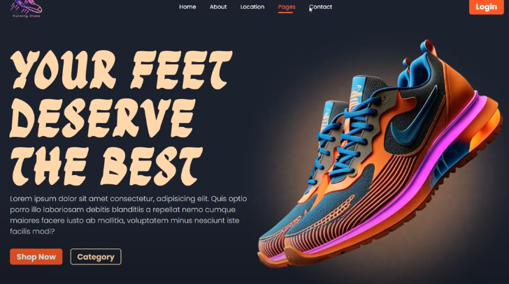

/*html*/

 <!DOCTYPE html>
    <html lang="en">
    <head>
        <meta charset="UTF-8">
        <meta name="viewport" content="width=device-width, initial-scale=1.0">
        <title>Portfolio</title>
        <link rel="stylesheet" href="styleSheets.css">
    </head>
    <body>
        <header>
            <nav>
                <ul>
                    <li><a href="#home">Home</a></li>
                    <li><a href="#about">About Me</a></li>
                    <li><a href="#projects">Projects</a></li>
                    <li><a href="#contact">Contact</a></li>
                </ul>
            </nav>
        </header>
    
       
   
    
<main>

    
    <!-- Home Section -->
    <section id="home">
        

            <h1>Welcome to My Portfolio</h1>
            
            
        

        
      
       

        
       
       
Hi, I'm Areeba, a passionate Front-End Web Developer. Explore my projects and skills!

            
       
        
    </section>

    <!-- About Me Section -->
    <section id="about">
        

            <h2>About Me</h2>
            
Hello! I am a passionate Computer Science student currently pursuing my BS in Computer Science at the University of Gujrat (UOG). I have already completed my Associate Degree in Computer Science (ADP) from UOG and am continuing my studies to expand my knowledge in software development, programming, and problem-solving..

        

        

            <h3>Skills</h3>
            <ul>
                <li>HTML, CSS</li>
                <li>Problem-Solving</li>
                <li>Team Collaboration</li>
                <li>Project Management</li>
            </ul>
        

    </section>

    <!-- Projects Section -->
    <section id="projects">
        <h2>My Projects</h2>
        

            
            <h3>Project 1</h3>
            
In the world of online shopping, a visually appealing landing page can make a huge difference in capturing customer attention and driving sales. If you’re passionate about sneakers and want to showcase them effectively, creating a sleek, modern, and responsive landing page is the way to go. In this blog post, I’ll guide you through designing a professional Sneaker Shoes Landing Page using only HTML & CSS. Plus, I’ll be sharing the source code so you can get started right away!

            <a href="https://github.com/ritesh-0309/Projects/tree/main/Ecommerce-Websites/Shoes-Website-1" target="_blank">View on GitHub</a>
        

        

            
            <h3>Project 2</h3>
            
This article is perfect for beginners and intermediate developers who want to create a professional-looking portfolio without relying on JavaScript or frameworks. So, let’s dive in and build an impressive personal website!

            <a href="https://github.com/ritesh-0309/Complete_Portfolio_Website" target="_blank">View on GitHub</a>
        

        

            
            <h3>Project 3</h3>
            
In today’s digital world, having a personal portfolio website is essential, whether you’re a developer, designer, or creative professional. But what if you could make it more interactive and visually appealing using only HTML and CSS? Yes! No JavaScript required.we’ll walk through the process of creating a fully responsive animated portfolio website using just HTML and CSS. You’ll also get access to the source code, allowing you to customize it and make it your own!

            <a href="https://github.com/ritesh-0309/Projects/tree/main/portfolio-websites/transparent-portfolio" target="_blank">View on GitHub</a>
        

    </section>

    <!-- Contact Section -->
    <section id="contact">
        <h2>Contact Me</h2>
        
If you'd like to get in touch, feel free to reach out to me via email or follow me on social media!

       
            <a href="mailto:abbasshaheer967@gmail.com">Email</a>
           <a href="https://linkedin.com/in/your-profile " target="_blank" >LinkedIn</a>
            <a href="https://github.com/your-profile" target="_blank" >GitHub</a>

           
       
    </section>
</main>

    <!-- Footer -->
    <footer>
        
&copy; 2025 Portfolio. All rights reserved.

    </footer>

</body>
</html>

/*css*/

/* General Styles */
* {
    margin: 0;
    padding: 0;
    box-sizing: border-box;
}

body {
    font-family: Arial, sans-serif;
    margin: 0;
    padding: 0;
    box-sizing: border-box;
    overflow: hidden;
    background: linear-gradient(to right, rgb(255,255,255), #f39f9f);
}

header {
    background-color:  #f39f9f;
    color:#571717;
    padding: 1rem;
    text-align: center;
}

nav ul {
    list-style-type: none;
    margin: 0;
    padding: 0;
}

nav ul li {
    display: inline;
    margin: 0 10px;
}

nav ul li a {
    color: white;
    text-decoration: none;
}

#home {
    text-align: center;
    padding: 50px;
}

.welcome-message h1 {
    font-size: 2rem;
}

#home img {
    width: 150px;
    height: 150px;
    border-radius: 50%;
    margin-top: 20px;
}

.nav-container{
    width: 100%;
    height: 100%;
    display: flex;
    justify-content: space-around;
    align-items: center;
}

nav a {
    color:#571717;
    padding: 15px;
    text-decoration: none;
}

/* Home Section */
#home {
    text-align: center;
    padding: 50px;
}

.welcome-message h1 {
    font-size: 2rem;
}

#home img {
    width: 350px;
    height: 350px;
    border-radius: 25%;
    margin-top: 20px;
   display: block;
   margin-left: 0%;
   
   
}

/* About Me Section */
#about {
    display: flex;
    justify-content: space-around;
    padding: 50px;
    background-color: #f3c1c1;
}

.bio, .skills {
    width: 45%;
}

.bio p {
    font-size: 1.1rem;
    color: #555;
}

.skills ul {
    list-style-type: none;
    padding: 0;
}

.skills li {
    font-size: 1rem;
    color: #333;
}

/* Projects Section */
#projects {
    padding: 50px;
    background-color: #f5d2d2;
    text-align: center;
}

.project {
    margin: 20px;
    display: inline-block;
    width: 30%;
    box-sizing: border-box;
}

.project img {
    width: 100%;
    height: auto;
}

.project h3 {
    font-size: 1.2rem;
    color: #333;
}

.project p {
    font-size: 1rem;
    color: #555;
}

.project a {
    color: #007BFF;
    text-decoration: none;
}

/* Contact Section */
#contact {
    padding: 50px;
    background-color: #f3c1c1;
    text-align: center;
}

#contact a {
    color: #007BFF;
    text-decoration: none;
    margin: 0 10px;
}

/* Always Show Scrollbar */
html, body {
    overflow-y: scroll; /* Forces vertical scrollbar */
    overflow-x: hidden; /* Hides horizontal scrollbar */
}

/* Show Scrollbar */
::-webkit-scrollbar {
    width: 10px; /* Adjust width */
}

/* Scrollbar Track */
::-webkit-scrollbar-track {
    background: #222; /* Dark track background */
}

/* Scrollbar Thumb (Draggable part) */
::-webkit-scrollbar-thumb {
    background: #666; /* Default thumb color */
    border-radius: 10px;
}

/* Scrollbar Thumb Hover Effect */
::-webkit-scrollbar-thumb:hover {
    background: #888; /* Lighter gray on hover */
}

/* Footer */
footer {
    background-color: #333;
    color: white;
    text-align: center;
    padding: 10px;
}

